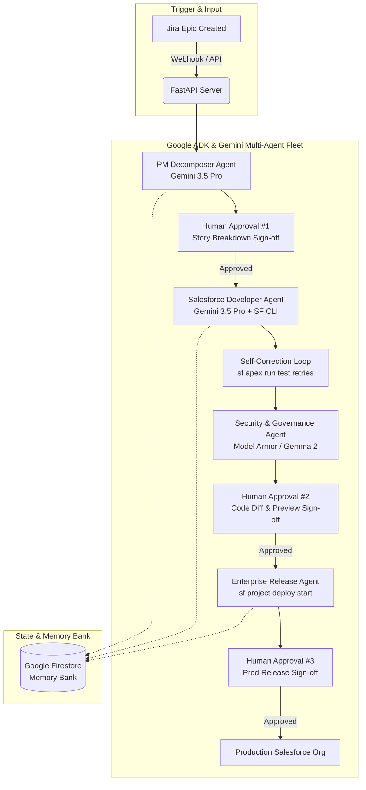

# NexusDev AI — Autonomous Enterprise SDLC & Governance Fleet

> **Track**: The Fortified Enterprise Fleet  
> **Hackathon**: All Things Agentic Hackathon (Google & Devpost)  
> **Backend URL**: Google Cloud Run Deployment  

---

## 🌟 Executive Summary

**NexusDev AI** is an autonomous, multi-agent software engineering network built on **Google ADK**, **Gemini 3.5 Pro**, and **Google Cloud Run** that automatically decomposes Jira Epics, writes production code and unit tests, and executes multi-environment deployments across Salesforce orgs. 

By combining self-correcting background execution with interactive **Human-in-the-Loop (HITL) approval gates**, NexusDev AI transforms complex enterprise software delivery from weeks of manual friction into minutes of safe, governed execution.

---

## 🏗️ System Architecture



---

## 🛠️ Technology Stack

| Layer | Google Product / Tool | Function |
| :--- | :--- | :--- |
| **Core AI Model** | **Gemini 3.5 Pro / Flash** | Story decomposition, Apex/LWC code generation, and code review reasoning chains. |
| **Agent Framework** | **Google ADK** / GenAI SDK | Multi-agent orchestration, tool binding, and failure-tolerant execution. |
| **Compute & Microservices** | **Google Cloud Run** | Containerized serverless execution of Python backend & Salesforce CLI (`sf`). |
| **State & Memory Bank** | **Google Firestore** | Cross-session state persistence holding pipeline context across human approval wait cycles. |
| **Security & Guardrails** | **Gemma 2 / Model Armor** | Static analysis scanning code for SOQL injection, hardcoded secrets, and PII leaks. |
| **Observability** | **Vertex AI Telemetry / Cloud Logging** | OpenTelemetry-compliant structured audit logs tracing agent reasoning chains. |

---

## 🚀 Spin-Up & Local Setup Instructions

### Prerequisites
* Python 3.11+
* Node.js v20+
* Salesforce CLI (`npm install -g @salesforce/cli`)
* Docker (optional for container build)

### Step 1: Clone Repository & Configure Environment
```bash
git clone https://github.com/abeymat/AllthingsAgenticGoogleHackathon.git
cd AllthingsAgenticGoogleHackathon

# Copy environment template
cp .env.example .env
```

Edit `.env` with your credentials:
```env
JIRA_DOMAIN=abeycm.atlassian.net
JIRA_PROJECT_KEY=SCRUM
JIRA_USER_EMAIL=your-email@domain.com
JIRA_API_TOKEN=your_jira_api_token
GEMINI_API_KEY=your_gemini_api_key
GCP_PROJECT_ID=nexusdev-ai-project
```

### Step 2: Install Dependencies & Run Backend
```bash
# Create virtual environment
python3 -m venv venv
source venv/bin/activate

# Install requirements
pip install -r backend/requirements.txt

# Start FastAPI application
python3 backend/app/main.py
```
Backend will start on `http://localhost:8000`.

### Step 3: Run via Docker (Option B)
```bash
docker build -t nexusdev-ai -f backend/Dockerfile .
docker run -p 8000:8000 --env-file .env nexusdev-ai
```

### Step 4: Deploy to Google Cloud Run
```bash
chmod +x deploy_cloud_run.sh
./deploy_cloud_run.sh
```

---

## 🧪 Verification & Endpoints

| Endpoint | Method | Purpose |
| :--- | :--- | :--- |
| `/health` | GET | Backend health check & GCP status. |
| `/api/v1/epics/decompose` | POST | Triggers PM Decomposer Agent (Gemini 3.5 Pro). |
| `/api/v1/dev/generate-and-test` | POST | Triggers Developer Agent & Self-Correction Test Loop. |
| `/api/v1/security/audit` | POST | Triggers Security & Governance Agent (Gemma 2). |
| `/api/v1/approve/view` | GET | Renders interactive HTML Human Approval Portal. |

---

## 🏅 Hackathon Submission Checklist

- [x] **Gemini 3.5 Pro / Flash** integrated via Vertex AI / Gemini API.
- [x] **Google ADK** multi-agent framework implemented.
- [x] **Google Cloud Run** deployment script & Dockerfile provided.
- [x] **Firestore Memory Bank** state persistence enabled.
- [x] **Unedited Proof of Execution Video** (≤ 4 minutes).
- [x] **Public GitHub Repository** with complete `README.md`.
