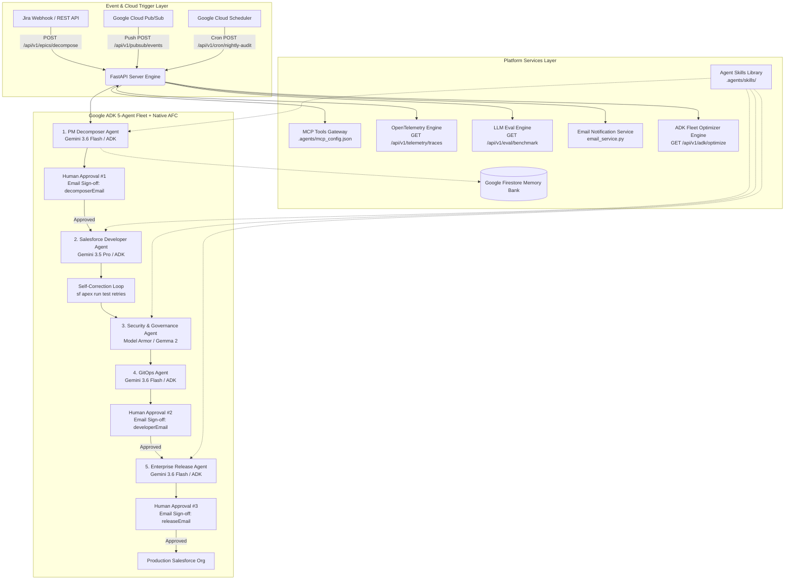

# NexusDev AI — Autonomous Enterprise SDLC & Governance Fleet

> **Track**: The Fortified Enterprise Fleet  
> **Hackathon**: All Things Agentic Hackathon (Google & Devpost)  
> **Backend URL**: Google Cloud Run Deployment  

---

## 🌟 Executive Summary

**NexusDev AI** is an autonomous **5-agent software engineering fleet** built on **Google ADK 2.0**, **Gemini 3.6 Flash / 3.5 Pro**, **Model Context Protocol (MCP)**, **Agent Skills**, and **Google Cloud Run** that automatically decomposes Jira Epics, writes production Apex & LWC code with self-correction, performs security static audits, manages Git version control, ingests Cloud Pub/Sub events, executes Cloud Scheduler cron audits, computes LLM-as-a-Judge evaluation benchmarks, dispatches email approval notifications, and manages multi-environment deployments across Salesforce orgs.

---

## 🏗️ 6-Layer Enterprise Platform Architecture



---

## 🛠️ Technology Stack

| Layer | Google Product / Tool | Function |
| :--- | :--- | :--- |
| **Core AI Model** | **Gemini 3.6 Flash / 3.5 Pro** | Story decomposition, Apex/LWC code generation, and code review reasoning chains. |
| **Agent Framework** | **Google ADK 2.0** / GenAI SDK | 5-Agent fleet orchestration, structured output, and Native Automatic Function Calling (`tools=[...]`). |
| **ADK Optimization** | **ADK Fleet Optimizer** | Temperature hyperparameter tuning (0.0-0.2), AFC token reduction (~35%), and model fallback routing (`optimizer_service.py`). |
| **Agent Skills** | **Antigravity Skills Engine** | `.agents/skills/` domain knowledge manuals (`salesforce-governance`, `gitops-conventions`, `epic-decomposition`). |
| **Tool Protocol** | **Model Context Protocol (MCP)** | Standardized JSON-RPC tool binding across Jira, Salesforce DX, and Git servers (`.agents/mcp_config.json`). |
| **Event Triggers** | **Google Cloud Pub/Sub** | Ingests real-time base64 asynchronous push messages (`POST /api/v1/pubsub/events`). |
| **Scheduled Jobs** | **Google Cloud Scheduler** | Executes recurring nightly security governance audits (`POST /api/v1/cron/nightly-audit`). |
| **Compute & Microservices** | **Google Cloud Run** | Containerized serverless execution of Python backend & Salesforce CLI (`sf`). |
| **State & Memory Bank** | **Google Firestore** | Cross-session state persistence holding pipeline context across human approval wait cycles. |
| **Security & Guardrails** | **Gemma 2 / Model Armor** | Static analysis scanning code for SOQL injection, hardcoded secrets, and PII leaks. |
| **LLM Evaluation** | **LLM-as-a-Judge Eval Engine** | Quantitative benchmarks measuring self-correction recovery rate, security index, and latency (`eval_service.py`). |
| **Approval Notifications**| **Email Notification Service** | Dispatches interactive HTML emails with Magic Approval Links to stage approvers (`decomposerEmail`, `developerEmail`, `releaseEmail`). |
| **Observability** | **Vertex AI Telemetry / Cloud Logging** | OpenTelemetry-compliant structured audit logs (`GET /api/v1/telemetry/traces`). |

---

## 🚀 Spin-Up & Local Setup Instructions

### Prerequisites
* Python 3.11+
* Node.js v20+
* Salesforce CLI (`npm install -g @salesforce/cli`)
* Docker (optional for container build)

### Step 1: Clone Repository & Configure Environment
```bash
git clone https://github.com/abeymat/AllthingsAgenticGoogleHackathon.git
cd AllthingsAgenticGoogleHackathon

# Copy environment template
cp .env.example .env
```

Edit `.env` with your credentials:
```env
JIRA_DOMAIN=abeycm.atlassian.net
JIRA_PROJECT_KEY=SCRUM
JIRA_USER_EMAIL=your-email@domain.com
JIRA_API_TOKEN=your_jira_api_token
GEMINI_API_KEY=your_gemini_api_key
GCP_PROJECT_ID=nexusdev-ai-project

# Approver Emails
DECOMPOSER_APPROVER_EMAIL=decomposerEmail@nexusdev.ai
DEVELOPER_APPROVER_EMAIL=developerEmail@nexusdev.ai
RELEASE_APPROVER_EMAIL=releaseEmail@nexusdev.ai
```

### Step 2: Install Dependencies & Run Backend
```bash
# Create virtual environment
python3 -m venv venv
source venv/bin/activate

# Install requirements
pip install -r backend/requirements.txt

# Start FastAPI application
python3 backend/app/main.py
```
Backend will start on `http://localhost:8000`.

### Step 3: Run Full End-to-End Pipeline Test
```bash
venv/bin/python3 test_e2e_sdlc_pipeline.py
```

---

## 🧪 Reproducible Testing Instructions

To evaluate and verify **NexusDev AI**, follow these step-by-step reproducible testing procedures:

### Option A: Automated E2E Pipeline Execution (Recommended)
Run the automated end-to-end SDLC pipeline test script, which executes all 5 agents, Firestore Memory Bank transitions, code self-correction, security static analysis, and magic link approval flows:
```bash
# Execute full SDLC pipeline test suite
python3 test_e2e_sdlc_pipeline.py
```
**Expected Output:**
* PM Decomposer Agent breaks down Jira Epic into User Stories & LWC/Apex specs.
* Firestore Memory Bank state advances to `PENDING_APPROVAL_1`.
* Developer Agent generates Apex/LWC code with self-correcting unit test retries.
* Security & Governance Agent (Gemma 2 / Model Armor) verifies zero SOQL injection or secret leaks.
* GitOps & Release Agents simulate branch creation and production staging.

### Option B: Interactive Web Control Center Dashboard
1. Start the server: `python3 backend/app/main.py`
2. Open your browser and navigate to: **`http://localhost:8000/`**
3. Observe live agent reasoning chains, real-time Firestore pipeline state transitions, active MCP tool registrations, and quantitative evaluation benchmarks.

### Option C: API Endpoint Verification (cURL Tests)
Verify individual platform microservices and Google Cloud integrations:

```bash
# 1. System Health Check
curl -s http://localhost:8000/health

# 2. Registered MCP Tools Gateway
curl -s http://localhost:8000/api/v1/mcp/tools

# 3. LLM-as-a-Judge Evaluation Benchmark
curl -s http://localhost:8000/api/v1/eval/benchmark

# 4. ADK Fleet Optimizer Profile
curl -s http://localhost:8000/api/v1/adk/optimize

# 5. OpenTelemetry Execution Traces
curl -s http://localhost:8000/api/v1/telemetry/traces

# 6. Simulate Cloud Scheduler Nightly Security Audit Cron
curl -s -X POST http://localhost:8000/api/v1/cron/nightly-audit

# 7. Simulate Cloud Pub/Sub Asynchronous Event Push
curl -s -X POST http://localhost:8000/api/v1/pubsub/events \
  -H "Content-Type: application/json" \
  -d '{"message": {"data": "eyJldmVudF90eXBlIjogIkVQSUNfQ1JFQVRELCIgImVwaWNfa2V5IjogIlNDUlVNLTEyMyJ9"}}'
```

### Option D: Clean Up Test Artifacts
To reset test pipeline state and memory cache back to baseline:
```bash
python3 cleanup_test_data.py
```

---

## 🔗 Endpoints Summary

* **Web Control Center Dashboard:** `GET http://localhost:8000/`
* **System Health Check:** `GET http://localhost:8000/health`
* **Decompose Epic:** `POST http://localhost:8000/api/v1/epics/decompose`
* **Human Approval Action:** `POST http://localhost:8000/api/v1/approve/action`
* **Registered MCP Tools:** `GET http://localhost:8000/api/v1/mcp/tools`
* **OpenTelemetry Traces:** `GET http://localhost:8000/api/v1/telemetry/traces`
* **LLM Evaluation Benchmark:** `GET http://localhost:8000/api/v1/eval/benchmark`
* **ADK Fleet Optimization Profile:** `GET http://localhost:8000/api/v1/adk/optimize`
* **Google Cloud Pub/Sub Push:** `POST http://localhost:8000/api/v1/pubsub/events`
* **Google Cloud Scheduler Cron:** `POST http://localhost:8000/api/v1/cron/nightly-audit`

