# NexusDev AI — Flow Diagram & Technical Architecture Blueprint

> **System Name:** NexusDev AI — Autonomous Enterprise SDLC & Governance Fleet  
> **Framework:** Google Agent Development Kit (ADK 2.0) & Gemini 3.6 Flash / 3.5 Pro  
> **Infrastructure:** Google Cloud Run, Cloud Firestore, Cloud Pub/Sub, Cloud Scheduler  

---

## 🔄 End-to-End Step-by-Step Process Flow Diagram

```mermaid
flowchart LR
    %% Inputs
    IN1[1. Jira Epic / Webhook] --> API
    IN2[2. Cloud Pub/Sub Push] --> API
    IN3[3. Cloud Scheduler Cron] --> API

    %% Step 1: PM Decomposer
    subgraph STAGE 1: EPIC DECOMPOSITION
        API[FastAPI Server Gateway] --> AGENT1[Node 1: PM Decomposer Agent<br/>Gemini 3.6 Flash]
        AGENT1 --> SCHEMA[Task Specs JSON Schema]
        SCHEMA --> MAIL1[Send Stage 1 Email<br/>abeycm@gmail.com]
        MAIL1 --> GATE1{Human Gate #1<br/>Review Task Specs}
    end

    %% Step 2: Development & Security Audit
    subgraph STAGE 2: DEVELOPMENT & GITOPS
        GATE1 -->|Approved| AGENT2[Node 2: Salesforce Developer Agent<br/>Gemini 3.5 Pro]
        AGENT2 <-->|Self-Correction Retries| TEST[SF CLI Unit Tests]
        AGENT2 --> AGENT3[Node 3: Security Governance Agent<br/>Gemma 2 Static Audit]
        AGENT3 --> AGENT4[Node 4: GitOps Agent<br/>Gemini 3.6 Flash]
        AGENT4 --> GIT[Commit & Push Feature Branch]
        GIT --> MAIL2[Send Stage 2 Email<br/>abeycm@gmail.com]
        MAIL2 --> GATE2{Human Gate #2<br/>Review Git PR & Security}
    end

    %% Step 3: Deployment & Release
    subgraph STAGE 3: ENTERPRISE RELEASE
        GATE2 -->|Approved| AGENT5[Node 5: Enterprise Release Agent<br/>Gemini 3.6 Flash]
        AGENT5 --> QA_DEPLOY[Deploy to QA Sandbox Org<br/>abeycm@curious-fox-3xbrbu.com]
        QA_DEPLOY --> REL_NOTES[Generate AI Release Notes]
        REL_NOTES --> MAIL3[Send Stage 3 Email<br/>abeycm@gmail.com]
        MAIL3 --> GATE3{Human Gate #3<br/>Review Prod Release}
        GATE3 -->|Approved| PROD_DEPLOY[Live Production Release<br/>epic.8fb9d0d7217c@orgfarm.salesforce.com]
    end

    %% Styling
    style GATE1 fill:#38bdf8,color:#0f172a,stroke-width:2px
    style GATE2 fill:#38bdf8,color:#0f172a,stroke-width:2px
    style GATE3 fill:#38bdf8,color:#0f172a,stroke-width:2px
    style PROD_DEPLOY fill:#22c55e,color:#0f172a,stroke-width:2px
```



---

## 🏗️ 6-Layer Enterprise System Architecture Diagram

```mermaid
flowchart TD
    subgraph Layer 1: Ingestion & Trigger Layer
        T1[Jira Cloud Webhook<br/>abeycm.atlassian.net] -->|POST /api/v1/epics/decompose| API_SERVER[FastAPI Orchestrator Engine<br/>backend/app/main.py]
        T2[Google Cloud Pub/Sub<br/>Push Topic Messages] -->|POST /api/v1/pubsub/events| API_SERVER
        T3[Google Cloud Scheduler<br/>Cron: 0 0 * * *] -->|POST /api/v1/cron/nightly-audit| API_SERVER
    end

    subgraph Layer 2: Google ADK 2.0 5-Agent Fleet + Native AFC
        API_SERVER --> A1[1. PM Decomposer Agent<br/>Gemini 3.6 Flash / temp=0.2]
        A1 -->|Task Specs| A2[2. Salesforce Developer Agent<br/>Gemini 3.5 Pro / temp=0.1]
        A2 <-->|Self-Correction Test Loop| A2_SF[Salesforce DX CLI<br/>sf apex run test]
        A2 -->|Apex / LWC Code| A3[3. Security Governance Agent<br/>Gemma 2 / temp=0.0]
        A3 -->|Audited Code| A4[4. GitOps Agent<br/>Gemini 3.6 Flash / temp=0.1]
        A4 -->|Committed Branch| A5[5. Enterprise Release Agent<br/>Gemini 3.6 Flash / temp=0.2]
    end

    subgraph Layer 3: Tools & Domain Skills (.agents/)
        MCP[MCP Tool Servers Gateway<br/>.agents/mcp_config.json] <-->|JSON-RPC| A1 & A2 & A4 & A5
        SKILLS[Agent Skills Library<br/>.agents/skills/] -.->|Domain Rules| A1 & A2 & A3 & A4 & A5
    end

    subgraph Layer 4: State Persistence & Memory Bank
        A1 & A2 & A5 <--> DB[(Google Cloud Firestore<br/>pipeline_sessions)]
    end

    subgraph Layer 5: Governance & Human-in-the-Loop (HITL)
        G1{Stage 1 Gate} -->|Token #1| EMAIL[Email Notification Service<br/>email_service.py]
        G2{Stage 2 Gate} -->|Token #2| EMAIL
        G3{Stage 3 Gate} -->|Token #3| EMAIL
        EMAIL -->|Magic Links| INBOX[Human Approver Inbox<br/>abeycm@gmail.com]
        INBOX -->|Approve| PORTAL[Interactive Approval Portal]
    end

    subgraph Layer 6: Observability, Eval & ADK Optimization
        OTEL[OpenTelemetry Engine<br/>telemetry.py] <--> GET_TRACES[GET /api/v1/telemetry/traces]
        EVAL[LLM-as-a-Judge Eval Engine<br/>eval_service.py] <--> GET_EVAL[GET /api/v1/eval/benchmark]
        OPT[ADK Fleet Optimizer Engine<br/>optimizer_service.py] <--> GET_OPT[GET /api/v1/adk/optimize]
    end

    A1 --> G1
    A4 --> G2
    A5 --> G3
    PORTAL -->|Approved| A2
    PORTAL -->|Approved| A5
    A5 -->|Stage 2 Approved| QA_ORG[QA Sandbox Org]
    A5 -->|Stage 3 Approved| PROD_ORG[Production Org]
```
